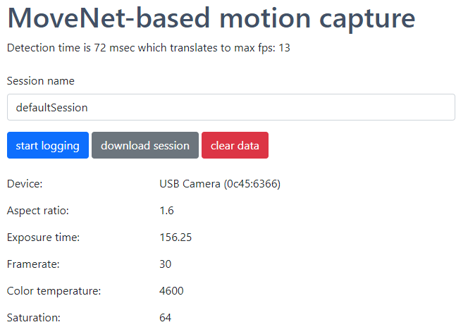
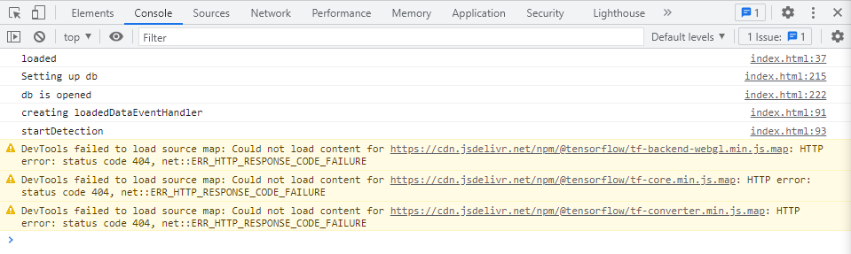
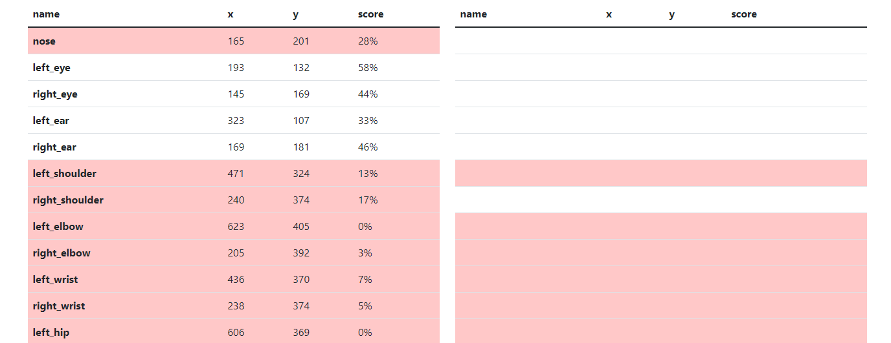
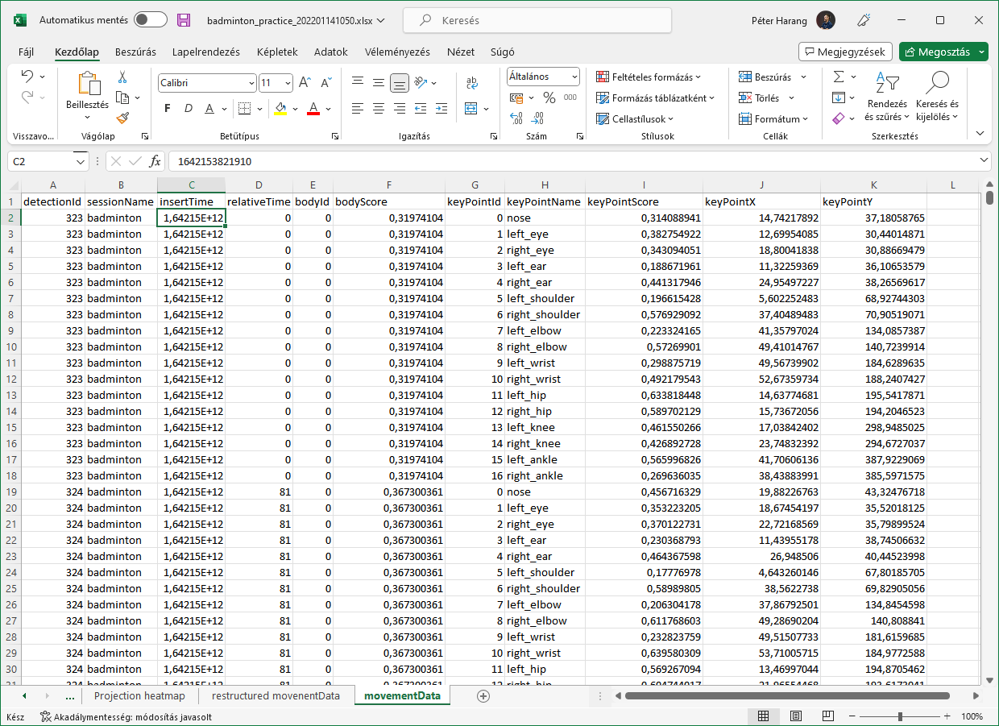

# Movenet-based motion capture running in the browser

## What will you find here

This is a single page HTML which includes everything what's required to initiate a camera feed, plug it into TFJS, do a motion capture, and store it into the browser's database. Some other files are just there for code snippets in documentation and/or images for illustration purposes.

The idea comes from watching the movenet demos on Tensorflow's site, and I was wondering how I could tap into the detection. Unfortunately, the demo didn't think about that, so I figrued I could do a simple implementation to bridge the gap.

## Status

### Changelog

- **1.0.0** - Initial/original concept

### Known issues

- I recon, when I left the recording on for and hour, around 40 mins, the recording just stopped. Should investigate what happened.
- If there was a lengthy recording session, I've found that download won't work immediately. Just restart the browser, then you'll be able to download the data.

## Usage

### General controls

Just navigate to the page (or, if you want to fiddle around, save it to your computer and start it from there). The browser should ask for accessing your camera, you have to allow it. If there's no camera attached, you won't see anything. If everything is ok, you should see the camera's picture, and some information on the capture device



**Give it a few seconds** to load the models, and your computer to setup Tensorflow. You can follow the process in the console, you should see something like this:



Detection will start automatically. You should see the detected points and lines between them, if detection is successful. Also, you will see the the **'detection time'**, and the calculation of max FPS under the title.

The main part shows **which part of the body is recognised**. There are two columns, one for each recognised person (as the model support it). Only the first two person's data is visualized, but if there are more persons on the screen, the data is saved for them as well.



The main reason this was developed, because I wanted to record myself playing sports, and needed to check the computer screen from far away. If I saw red, it needed some adjustments.

If you want to **save the recording session**, just give it a name (the default is "defaultSession"), and press **start logging**. This will stat to save the detection in the browser's IndexedDB, with the name, you've given in the "session name" field.

To stop it, just press **stop logging**. Pretty simple.

You can download the saved session in CSV format by pressing the "download session" button. Give it some time, there can be lot's of data.

### Development controls

There are two major constants that control the detection:

``` JS
const SCORE_THRESHOLD = 0.3;
```
This controls the recognition threshold. If score goes bellow this number, it will be marked red  on the screen fort he bodypart.

``` JS
const detectorConfig = {
  modelType: poseDetection.movenet.modelType.MULTIPOSE_LIGHTNING,
  enableTracking: true,
  trackerType: poseDetection.TrackerType.BoundingBox
};
```
This part is the standard detector config, which is passed to TF, to detect. You can play around if you want to, it's pretty much standard. For example, if you want to use the Blaze model, just exchange the modelType to this: `modelType: poseDetection.SupportedModels.BlazePose.lite`

## Output structure

The CSV has the output format like this:



It's pretty much self-explanatory. Now that you have the info in excel, you can start to analyze your data with your conventional tools.

## Contribution, discussion, etc

This project won't be really maintained, it is just an example of how to do integrate TensorFlow.JS into a webpage the simplest way possible.

## License

As noted in the LICENSE.md file, this work is licensed under Creative Commons BY-NC 4.0 **If you found it useful, please leave a star.** Thanks.

For commercial usage, please conatact the author.